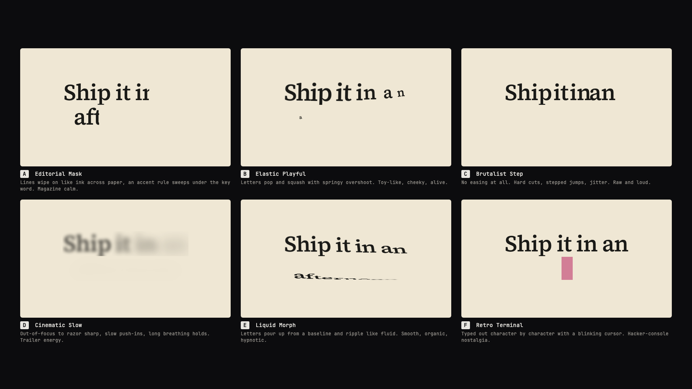
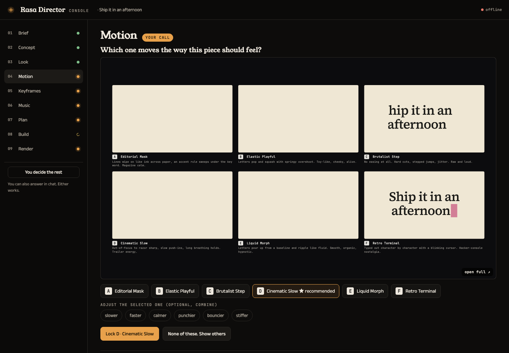
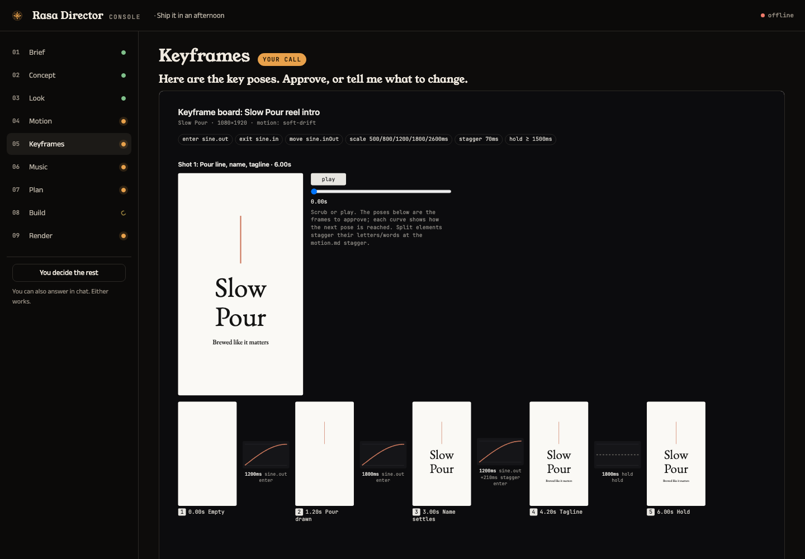
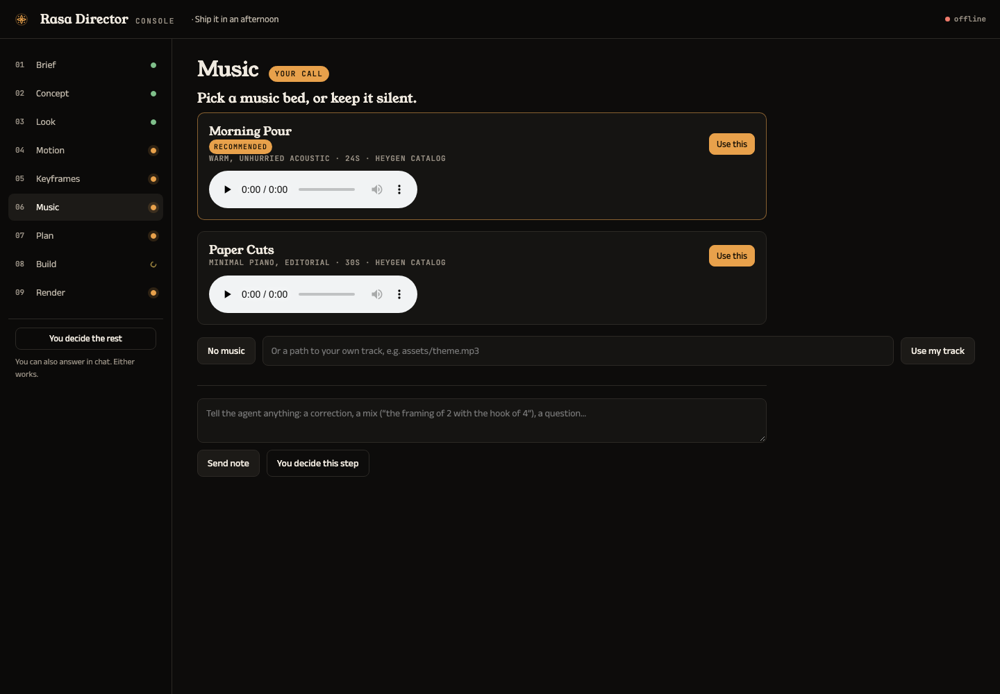
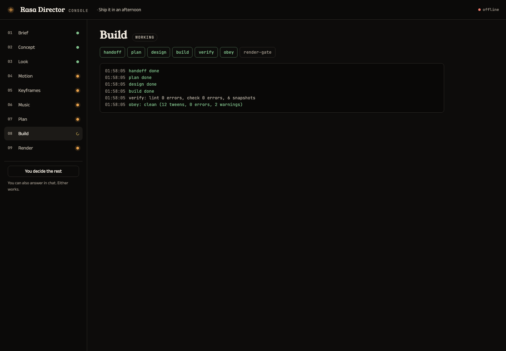

# Rasa Director

**Creative direction for entire videos made with Claude.** Launch films, explainers, PR videos, brand reels, music videos, footage with captions or overlays, and short motion graphics. Decide how the whole film tells its story, looks, moves, cuts and sounds, by eye and ear, before anything is built. You're the director, Rasa handles taste, [HyperFrames](https://hyperframes.heygen.com) shoots.

*Rasa* (ரசம் · रस) is the essence a work makes its audience feel. Every AI video has the same one: the obvious story, a default look, and text that fades up and slides into place on the same ease-out curve in every scene. Rasa Director is a Claude Code skill that lets you choose a different one, then makes sure the build actually uses it.



**Website:** https://sibhimanyu.github.io/rasa-director/

## What it does

You say `/rasa-director make a 45s launch film for tally.app`. Rasa Director opens a **Director's Console** in your browser and walks you through every creative decision, each made on a preview of your own video:

| Step | You see | You decide |
|---|---|---|
| 1 Brief | a form | what the video is, the key line, where it plays (16:9, 9:16, 1:1, 4:5), length, voiceover or not |
| 2 Route | the HyperFrames workflows that fit | launch film, explainer, PR video, music video, captions, overlay recut, custom |
| 3 Story | five pitches, at least two a model wouldn't usually produce | the idea and its arc |
| 4 Scenes | the whole film as an editable scene table and timeline | every scene's on-screen text, voiceover line, length, transition, intensity |
| 5 Look | HyperFrames frame presets, live | palette, type, layout (or your brand spec), remixed onto your brand |
| 6 Motion | the **tasting menu**: three of your scenes playing in order in six motion personalities | one motion grammar for the whole film; adjust with "slower", "calmer", "punchier"… |
| 7 Transitions | your first two scenes handing off through every transition, looping | how scenes hand off (per-scene overrides in the table) |
| 8 Voice | your hook line spoken in three voices | the narrator, or none |
| 9 Music | two or three tracks with players | a bed, your own track, or silence |
| 10 Storyboard | the timeline, then the workflow's sketch of every scene in your look | approve, or "make scene 3 calmer" |
| 11 Build & render | the plan, live build progress, proof snapshots, the final video | "build it", "preview first", "render" |

Any step can be handed back with **"you decide"**, or everything after it with **"you decide the rest"**. That never means the generic default: the agent samples unusual options, rotates away from what it picked last time, and gives a one-line receipt for every choice. Answer in the console or in chat, whichever you like. Steps a route doesn't need (no scene list for a captions job) are skipped.



Then it hands the approved plan to the matching [HyperFrames](https://hyperframes.heygen.com) workflow (`product-launch-video`, `faceless-explainer`, `pr-to-video`, `general-video`, `music-to-video`, `talking-head-recut`, `embedded-captions`, or `motion-graphics` for a single short unit). Rasa pre-writes what that workflow reads (BRIEF.md, the storyboard and script in its exact format, frame.md, the music bed), so it asks nothing and re-decides nothing. The motion choice is locked in a binding `motion.md` (durations, eases, stagger, holds, banned patterns), written into frame.md and every frame worker's packet, and every built scene is checked in headless Chrome before the render question.

| Keyframe board | Music | Build |
|---|---|---|
|  |  |  |

## Install

Requirements: [Claude Code](https://claude.com/claude-code), Node.js ≥ 20, and the HyperFrames skills (`npx hyperframes skills update`). Chrome for previews and checks comes from `npx hyperframes browser ensure`. Voice samples and music use HyperFrames' media tools (the `heygen` CLI, signed in); without them the workflow's default voice is used and you can bring your own track or none.

**Claude Code plugin** (recommended)

```
/plugin marketplace add Sibhimanyu/rasa-director
/plugin install rasa-director@rasa-director
```

**skills CLI**

```bash
npx skills add Sibhimanyu/rasa-director --skill rasa-director
```

**One-line installer** (links `~/.claude/skills/rasa-director` to a checkout in `~/.rasa-director/src`; run again to update, `--uninstall` to remove)

```bash
curl -fsSL https://raw.githubusercontent.com/Sibhimanyu/rasa-director/master/install.sh | bash
```

**By hand**

```bash
git clone https://github.com/Sibhimanyu/rasa-director.git
ln -s "$PWD/rasa-director/skills/rasa-director" ~/.claude/skills/rasa-director
```

Check the install: `node ~/.claude/skills/rasa-director/scripts/selftest.mjs` (34 checks, about a minute, no network needed). With the plugin install the skill lives under `~/.claude/plugins/cache/rasa-director/`; run the same script from there.

With the plugin install Claude Code namespaces the skill: invoke it as `/rasa-director:rasa-director` (or just describe the video you want; it triggers on video requests).

## Use

```
/rasa-director make a 45s launch film for https://tally.app
/rasa-director a 60s explainer on how DNS works, vertical, no voiceover. You decide the look.
/rasa-director turn PR #482 into a 30s changelog video
/rasa-director a lyric video for song.mp3, you decide the rest
/rasa-director add bold captions to interview.mp4 for Reels
/rasa-director a 6s title sting for "Ship it in an afternoon"
/rasa-director revise videos/tally-launch: calmer motion, swap the music
```

## How it works

```
skills/rasa-director/
  SKILL.md                    the step machine the agent follows
  console/index.html          the Director's Console page
  personalities/*.json        10 motion personalities: eases, duration scale, stagger, holds, bans, demo
  scripts/
    console.mjs               the console server + push / wait / log / record (127.0.0.1, token-protected)
    tasting.mjs               the tasting menu (one line, or several of your scenes in sequence); also a valid composition
    pick.mjs                  candidates and "you decide" picks (feel vocabulary, tail sampling, rotation)
    motion-md.mjs             writes motion.md; adjectives (slower, faster, calmer, punchier, bouncier, stiffer)
    board.mjs                 the keyframe board, validated against motion.md (scale, stagger, holds, bans)
    scenes.mjs                the scene list -> STORYBOARD.md + SCRIPT.md in the workflows' exact format, + timeline
    transition-menu.mjs       two of your scenes handing off through every registry transition
    voice.mjs                 your hook line in 3 voices (HeyGen via media-use)
    music.mjs                 music candidates through HyperFrames media-use
    video.mjs                 entire videos: init, capture, write the plan into the project (BRIEF.md, frame.md +
                              motion contract, storyboard, script, music), inject into frame packets, audio-lock; revise
    handoff.mjs               single short units: the /motion-graphics project; revise mode
    obey.mjs                  checks the built composition obeys motion.md; waive
    memory.mjs                remembered picks (recommend) vs pick history (rotation)
    selftest.mjs              the checks CI runs
    lib/                      shared helpers, the choreography engine, banned-pattern signatures
    vendor/gsap.min.js        GSAP 3.14.2
  references/                 per-workflow integration, console payloads, motion.md contract, board format, handoff, personalities
```

- **The personalities** are data, not prose: each one's own preview passes the same checker the build must pass, so what you pick in the tasting menu is what gets enforced.
- **The checker** (`obey.mjs`) loads each composition in headless Chrome with GSAP, walks every tween, samples its real start and end values, and flags off-scale durations, eases outside the set, implicit default eases, banned patterns (fade-up-slide in all its forms, bounce, overshoot, blur-in, scale-pop…), non-GSAP motion and short holds. "Could not run" is never reported as clean.
- **Local only.** The console binds to 127.0.0.1, refuses foreign Host headers, and requires a per-session token (then an HttpOnly cookie) for every route; it serves files only from your workspace and installed skills, never its own token file, and refuses to run with your home directory as the root. Voice samples, music and site capture go through HyperFrames' own tools; nothing else leaves your machine.

Details: [SKILL.md](skills/rasa-director/SKILL.md) · [entire videos](skills/rasa-director/references/video.md) · [console](skills/rasa-director/references/console.md) · [motion.md contract](skills/rasa-director/references/motion-md-contract.md) · [keyframe board](skills/rasa-director/references/board-format.md) · [handoff](skills/rasa-director/references/handoff.md) · [personalities](skills/rasa-director/references/personalities.md) · [design doc](docs/designs/motion-director.md)

## Publishing notes (for the maintainer)

- The repo is public. The install commands work as soon as `skills/`, `.claude-plugin/` and `install.sh` are pushed to `master`.
- The website deploys from `docs/` via `.github/workflows/site.yml` (Pages source: GitHub Actions); every push to `docs/` redeploys, and it can be run by hand from Actions → site.
- CI (`.github/workflows/ci.yml`) runs the self-test on every push.

## Known limits

- Previews are text-only: scenes are previewed with their words; the real product shots, logos and data enter at build.
- Footage editing uses the HyperFrames footage workflows as they are (captions, overlay cards); Rasa directs their style. Cutting motion-graphics scenes into a sequence of your own clips goes through `general-video`; deeper footage tools are next.
- HyperFrames' frame presets are designed at 16:9. At other aspects the look is judged again in the tasting cells, at the real aspect.
- Previews use Google Fonts; offline they fall back to system fonts.
- The checker verifies GSAP motion (motion.md requires GSAP builds).
- The hand-off to each workflow (plan files, packet injection, music lock) is tested on real projects; a complete rendered film through every workflow hasn't been run for each route yet.

## License

MIT. `skills/rasa-director/scripts/vendor/gsap.min.js` is GSAP 3.14.2 under the [GSAP Standard License](https://gsap.com/standard-license).

Built on [HyperFrames](https://hyperframes.heygen.com) and [Claude Code](https://claude.com/claude-code).
