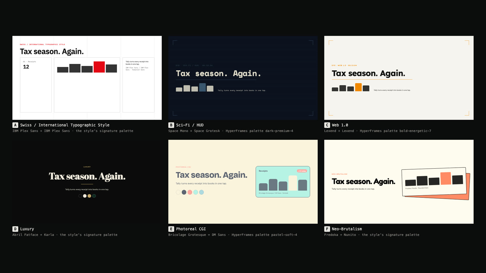
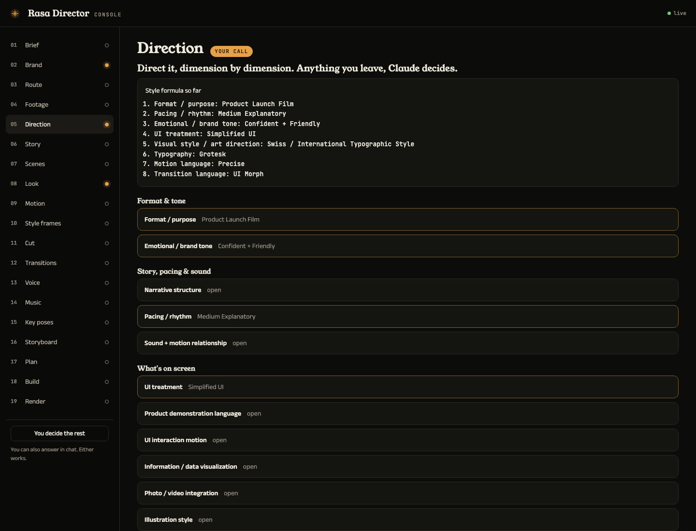
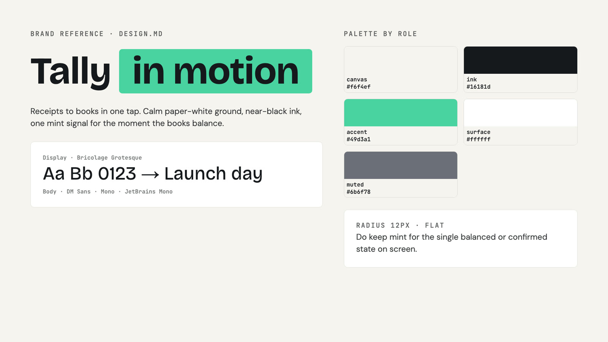
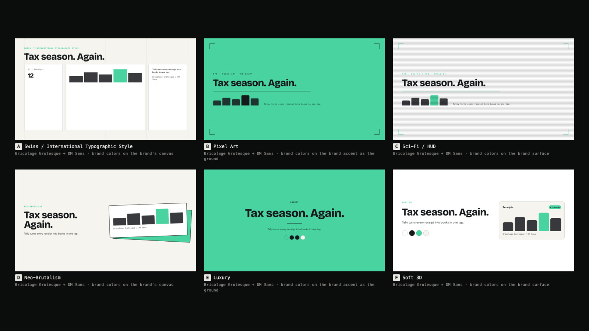
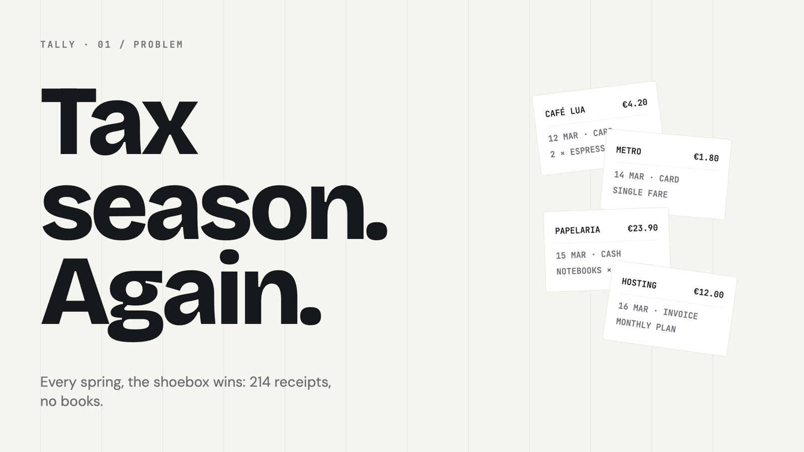

<h1><picture>
  <source media="(prefers-color-scheme: dark)" srcset="docs/assets/logo/rasa-director-lockup-reverse.svg" />
  
</picture></h1>

**Direct your whole video in the terms motion designers use. Claude designs and animates it.** Launch films, explainers, PR videos, brand reels, music videos, reels cut from a folder of your own footage, captioned talking heads, and short motion graphics.

*Rasa* (रस) is the feeling a work leaves in its audience; *rasanai* (ரசனை) is the Tamil word for the taste to choose it. Left alone, every AI video has the same one: the obvious story, a default look, and text that fades up and slides into place on the same ease in every scene. Rasa Director is a Claude Code skill that puts every creative decision in front of you in proper terms, shows it by eye, compiles your choices into an art-direction brief and a motion contract, and checks that what Claude builds follows them.



**Website:** https://sibhimanyu.github.io/rasa-director/

## A style is a stack of decisions

Two videos can both be "2D UI animation" and look nothing alike, because a style is never one choice. Rasa Director holds the vocabulary of motion design as data: **30 dimensions and about 880 terms** (format, UI treatment, product-demo language, UI interaction, data viz, photo/video integration, illustration, character, iconography, visual style, era, color, typography, composition, shape, stroke, shadow, material, texture, depth, motion language, motion function, transitions, camera, effects, pacing, narrative, sound, production, tone). Every term has a definition, what it looks like, how it moves, where it's used, what it's often confused with, and the precise instruction Claude follows. 35 known style combinations help Claude decide the dimensions you hand over, and it never picks the generic default.

Your picks compile into **`DIRECTION.md`**: a style name ("Swiss / International Typographic Style, simplified-UI product launch film, precise motion"), the style formula as a stack, and a Do / not-to-be-confused-with instruction for every decision. It goes to every builder with **`motion.md`**, the motion contract of the motion language you chose.



## What it does

You say `/rasa-director make a 45s launch film for tally.app`. Rasa Director opens a **Director's Console** in your browser and walks you through every decision, each shown on your own content:

| Step | You see | You decide |
|---|---|---|
| 1 Brief | a form | what the video is, the key line, where it plays, length, voiceover or not |
| 2 Brand | your DESIGN.md read back as a board (if the project has one) | use your brand as the look, on a new layout, or not at all |
| 3 Route | the HyperFrames workflows that fit | launch film, explainer, PR video, music video, footage reel, captions, overlay recut, custom |
| 4 Direction | every dimension as terms with definitions, and a live style formula | pick per dimension, or "Claude decides"; share references and Claude analyzes them into terms |
| 5 Story | five pitches, at least two a model wouldn't usually produce | the idea and its arc |
| 6 Scenes | the whole film as an editable scene table and timeline | every scene's text, voiceover, length, transition, intensity |
| 7 Look | **design directions**: complete looks (palette by role, type pairing, shape, stroke, shadow, texture, composition) on your words; brand-locked if you have a brand | the look |
| 8 Motion | swatches of your lines in candidate **motion languages** (precise, snappy, elastic, cinematic, stop-motion-like…) | the motion language and its contract |
| 9 Style frames | the key frames **Claude designs** in the chosen direction | approve, or say what to change, before anything moves |
| 10 Transitions | your scenes handing off through every transition | how scenes hand off |
| 11 Voice | your hook line in three voices | the narrator, or none |
| 12 Music | tracks with players | a bed, your own track, or silence |
| 13 Storyboard | the timeline, then every scene sketched in your look | approve |
| 14 Build & render | live build progress, proof snapshots, the final video | "preview first", "render" |

**Footage reels** add **Footage** (every clip in your folder with a contact sheet and a word-level transcript) and **Cut** (the edit as an editable list: clips with in and out points, cards between them, overlays on top, captions). Claude drafts the cut from your direction, then designs and animates every card and overlay itself from a brief per card.

Any step can be handed back with **"you decide"**, or everything after it with **"you decide the rest"**, with a one-line receipt for every choice Claude makes.

**Claude does the animating.** Rasa's boards and swatches exist only so you can choose by eye. Claude designs the style frames, the scenes and the reel cards from `DIRECTION.md`, `frame.md` and `motion.md`, through the matching [HyperFrames](https://hyperframes.heygen.com) workflow (`product-launch-video`, `faceless-explainer`, `pr-to-video`, `general-video`, `music-to-video`, `talking-head-recut`, `embedded-captions`, `motion-graphics`), and every built scene is checked in headless Chrome against the motion contract before the render question.

| Your DESIGN.md as the look | Brand-locked design directions | A style frame Claude designed |
|---|---|---|
|  |  |  |

**Bring your DESIGN.md.** Rasa reads the common shapes (design.md spec frontmatter with oklch colors and nested typography, impeccable, gstack, Stitch-style prose, CSS custom properties, token tables), assigns every color a role, maps platform fonts to shipped equivalents, stages the fonts, and writes a frame.md HyperFrames accepts, verified with HyperFrames' own parser. [An example](docs/examples/DESIGN.md).

## Install

Requirements: [Claude Code](https://claude.com/claude-code), Node.js ≥ 20 (if you don't have it, Rasa finds or fetches a private copy on first run), the HyperFrames skills (`npx hyperframes skills update`), and FFmpeg for footage reels. Chrome for previews and checks comes from `npx hyperframes browser ensure`. Voice samples and music use HyperFrames' media tools (the `heygen` CLI, signed in); without them the workflow's default voice is used and you can bring your own track or none.

**Claude Code plugin** (recommended)

```
/plugin marketplace add Sibhimanyu/rasa-director
/plugin install rasa-director@rasa-director
```

**skills CLI**

```bash
npx skills add Sibhimanyu/rasa-director --skill rasa-director
```

**One-line installer** (links `~/.claude/skills/rasa-director` to a checkout in `~/.rasa-director/src`; run again to update, `--uninstall` to remove)

```bash
curl -fsSL https://raw.githubusercontent.com/Sibhimanyu/rasa-director/master/install.sh | bash
```

**By hand**

```bash
git clone https://github.com/Sibhimanyu/rasa-director.git
ln -s "$PWD/rasa-director/skills/rasa-director" ~/.claude/skills/rasa-director
```

### Updating

Rasa checks for a new release when a run starts (at most once a day, silently offline) and tells you in one line; say **update** and Claude updates it the way you installed it. Set `RASA_DIRECTOR_AUTO_UPDATE=1` to update without asking, or `RASA_DIRECTOR_NO_UPDATE_CHECK=1` to turn the check off. By hand:

| Installed with | Update |
|---|---|
| Claude Code plugin | `/plugin marketplace update rasa-director`, then `/plugin update rasa-director@rasa-director`; restart Claude Code |
| skills CLI | `npx skills add Sibhimanyu/rasa-director --skill rasa-director` again |
| one-line installer | run the installer again |
| by hand | `git pull` in the checkout |

Or run `node <skill dir>/scripts/update.mjs apply`, which works out which of these applies. Versions before 0.4.2 have no update check; update them once by hand.

Check the install: `node ~/.claude/skills/rasa-director/scripts/selftest.mjs` (52 checks, about two and a half minutes, no network needed). With the plugin install the skill lives under `~/.claude/plugins/cache/rasa-director/`; run the same script from there.

With the plugin install Claude Code namespaces the skill: invoke it as `/rasa-director:rasa-director` (or just describe the video you want; it triggers on video requests).

## Use

```
/rasa-director make a 45s launch film for https://tally.app
/rasa-director a 60s explainer on how DNS works, vertical, no voiceover. You decide the look.
/rasa-director turn PR #482 into a 30s changelog video
/rasa-director a lyric video for song.mp3, you decide the rest
/rasa-director cut ~/Footage/lisbon-trip into a 30s reel: best moments, a title card, captions
/rasa-director add bold captions to interview.mp4 for Reels
/rasa-director a 6s title sting for "Ship it in an afternoon", neo-brutalist, springy
/rasa-director a product film for our app using our DESIGN.md, like these references: ref1.png ref2.png
/rasa-director revise videos/tally-launch: calmer motion, swap the music
```

## How it works

```
skills/rasa-director/
  SKILL.md                    the step machine the agent follows
  console/index.html          the Director's Console page
  taxonomy/                   the motion-design vocabulary: 30 dimensions (dimensions/*.json), 35 style
                              combinations, type pairings for design directions; SCHEMA.md
  personalities/*.json        10 calibrated preview swatches (the motion languages borrow their choreography)
  scripts/
    taxonomy.mjs              validate, list and look up terms
    direction.mjs             decisions -> DIRECTION.md; "you decide" candidates; reference analyze / compare
    design.mjs                design directions (looks) as boards + frame.md; style-frame stills
    brand.mjs                 a project's DESIGN.md: detect, read, convert to frame.md / tokens.json, brand board
    console.mjs               the console server + push / wait / log / record (127.0.0.1, token-protected)
    tasting.mjs               motion-language swatches of your lines
    motion-md.mjs             writes motion.md from a motion-language term; adjectives (slower, calmer…)
    scenes.mjs                the scene list -> STORYBOARD.md + SCRIPT.md in the workflows' exact format
    transition-menu.mjs       two of your scenes handing off through every registry transition
    voice.mjs, music.mjs      voice samples and music candidates through HyperFrames media-use
    reel.mjs                  footage reels: scan; card briefs for Claude; build (segments, Claude's cards,
                              captions, ducked music), lint, obey, render
    video.mjs                 entire videos: init, capture, write the plan (BRIEF.md, frame.md with fonts,
                              contract and direction, DIRECTION.md, storyboard, script, music), inject, audio-lock
    handoff.mjs               single short units: the /motion-graphics project
    obey.mjs                  checks built compositions obey motion.md; waive
    board.mjs, pick.mjs, memory.mjs, selftest.mjs
    lib/                      design-md (the DESIGN.md adapter), looks, direction, install, fonts, taxonomy,
                              motion-lang, engine (preview choreography), signatures, common
    vendor/gsap.min.js        GSAP 3.14.2
  references/                 direction, brand, video, reel, console, motion.md contract, board, handoff, personalities
```

- **The terms are data.** Every option shown and every decision recorded is a taxonomy term, and prompts to builders are compiled from its entry. Each motion language carries a contract, and its swatch passes the same checker the build must pass.
- **The checker** (`obey.mjs`) loads each composition in headless Chrome with GSAP, walks every tween, samples its real start and end values, and flags off-scale durations, eases outside the set, implicit default eases, banned patterns (fade-up-slide in all its forms, bounce, overshoot, blur-in, scale-pop…), non-GSAP motion and short holds. "Could not run" is never reported as clean.
- **Local only.** The console binds to 127.0.0.1, refuses foreign Host headers, and requires a per-session token (then an HttpOnly cookie) for every route; it serves files only from your workspace and installed skills, never its own token file, and refuses to run with your home directory as the root. Voice samples, music and site capture go through HyperFrames' own tools; nothing else leaves your machine.

Details: [SKILL.md](skills/rasa-director/SKILL.md) · [direction & taxonomy](skills/rasa-director/references/direction.md) · [DESIGN.md](skills/rasa-director/references/brand.md) · [entire videos](skills/rasa-director/references/video.md) · [footage reels](skills/rasa-director/references/reel.md) · [console](skills/rasa-director/references/console.md) · [motion.md contract](skills/rasa-director/references/motion-md-contract.md) · [keyframe board](skills/rasa-director/references/board-format.md) · [handoff](skills/rasa-director/references/handoff.md) · [personalities](skills/rasa-director/references/personalities.md) · [design doc](docs/designs/motion-director.md)

## Publishing notes (for the maintainer)

- The repo is public. The install commands work as soon as `skills/`, `.claude-plugin/` and `install.sh` are pushed to `master`.
- The website deploys from `docs/` via `.github/workflows/site.yml` (Pages source: GitHub Actions); every push to `docs/` redeploys, and it can be run by hand from Actions → site.
- CI (`.github/workflows/ci.yml`) runs the self-test on every push.

## Known limits

- Boards and swatches are previews made from tokens and text; the real frames (product shots, logos, data, illustration) are designed by Claude at style-frame and build time.
- The DESIGN.md adapter reads the common formats but brand documents vary a lot; it reports what it couldn't find (fonts, an accent) and the brand board shows what it understood before anything is built.
- Footage reels cut on word boundaries from Whisper transcripts and on detected shot changes; there's no automatic best-take or visual-content ranking beyond what Claude reads from the contact sheets and transcripts. Cards and overlays run at least their motion's minimum length (entrance, required hold, exit); a shorter request is lengthened with a warning.
- Previews use Google Fonts; offline they fall back to system fonts.
- The checker verifies GSAP motion (motion.md requires GSAP builds).
- The hand-off to each workflow (plan files, packet injection, music lock) is tested on real projects; a complete rendered film through every workflow hasn't been run for each route yet.

## License

MIT. `skills/rasa-director/scripts/vendor/gsap.min.js` is GSAP 3.14.2 under the [GSAP Standard License](https://gsap.com/standard-license).

Built on [HyperFrames](https://hyperframes.heygen.com) and [Claude Code](https://claude.com/claude-code).
