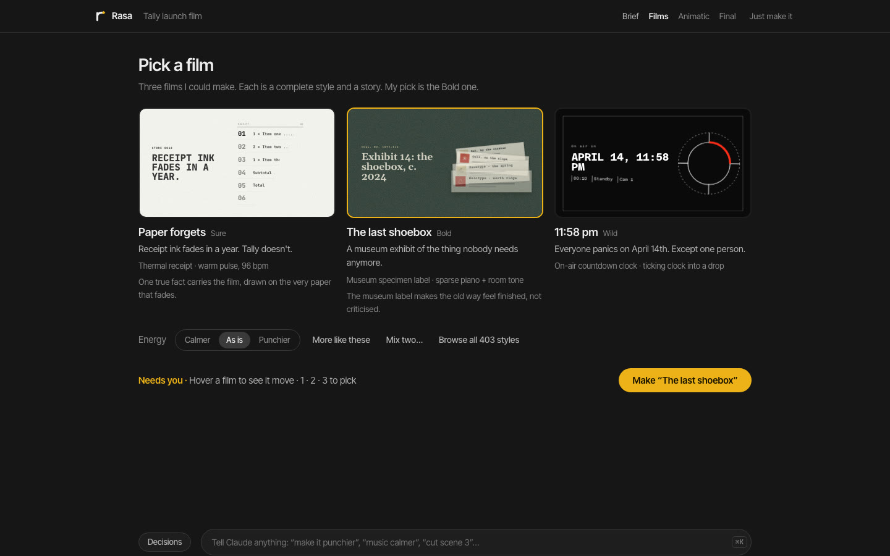
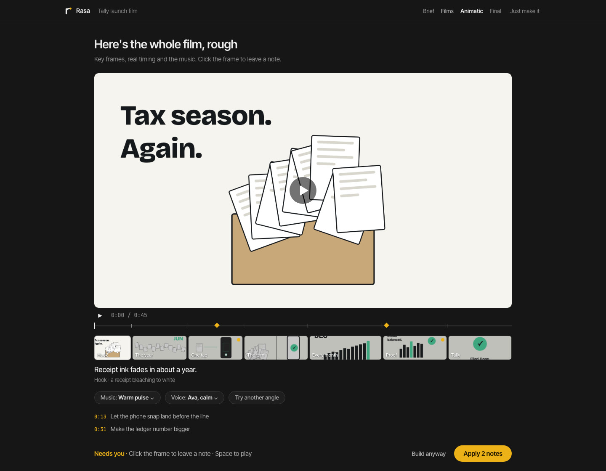
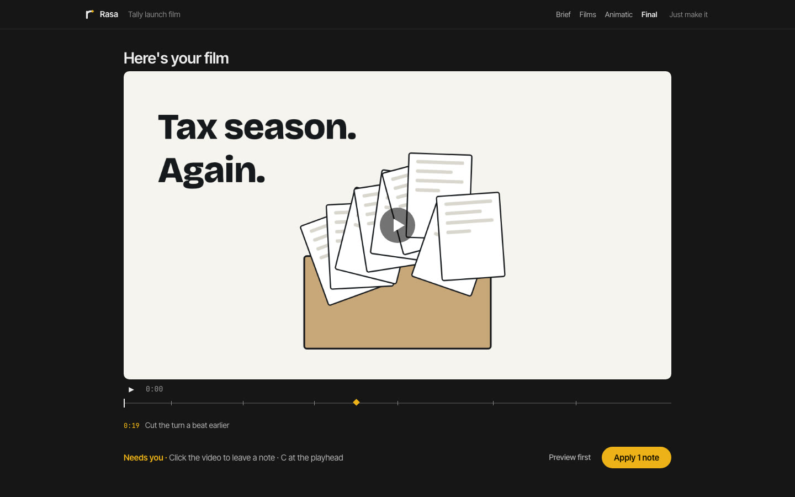

<h1><picture>
  <source media="(prefers-color-scheme: dark)" srcset="docs/assets/logo/rasa-director-lockup-reverse.svg" />
  
</picture></h1>

**Pick the film. Claude makes it.** Launch films, explainers, PR videos, brand films, music videos, reels cut from a folder of your own footage, captioned talking heads, and short motion graphics.

*Rasa* (रस) is the feeling a work leaves in its audience; *rasanai* (ரசனை) is the Tamil word for the taste to choose it. When thirty people make an AI video, they get thirty videos with different content and the same film: the obvious story, a default look, everything fading up on one ease, a 30-second music loop under a 45-second film, a whoosh on every cut and glowing text. Rasa Director is a Claude Code skill that replaces every one of those defaults with a decision, and checks the build against it.



**Website:** https://sibhimanyu.github.io/rasa-director/

## Four calls, and you see your film at every one

You say `/rasa-director make a 45s launch film for tally.app`. A **Director's Console** opens in your browser: a dark review room that shows what Claude is doing, live, and stops you only four times.

| | You see | You do |
|---|---|---|
| **1 · Brief** | one sentence you can edit: "A 45-second launch film for Tally, 16:9 for the website, with voiceover, in Tally's own colours and type", and what Claude captured | fix a word, press Start, or **Just make it** |
| **2 · Films** | three complete films, each a named design system drawn live and moving on the film's own opening line, with a story angle (Sure · Bold · Wild), a logline and its music | pick one; or "more like these", "mix two", an energy knob, browse all the styles |
| **3 · Animatic** | the whole film rough: a key frame for every scene at its real length, with the real music edit and the voice | play it, click any moment to leave a note, swap the music or voice, then **Looks right, build it**. You watch it build, scene by scene |
| **4 · Final** | the rendered film with scene markers, versions and what changed | click a moment to note it, apply notes, render, download |

**Claude decides the craft**, the way a senior motion designer would, from a quantified playbook: the story device, the scenes and their timing, the motion language, transitions, the music edit, every sound effect, lighting and grade. Every call is in the **Decisions** drawer with its reason, and you can change any of it by telling Claude (⌘K).



## What makes the films different

- **A story, not the story.** Before any concept, Claude writes a truth sheet from your product (what really changes, for whom, in the product's own words and numbers). A catalogue of 66 narrative devices from great launch films and ads (the museum label, the countdown, the one-take, the object's point of view…) gives three pitches that differ on at least five axes, and a rubric rejects the default arc (hook, problem, "Introducing X", three features, call to action) and any pitch that would work for any product.
- **403 design systems.** A library of named motion-graphics styles in 20 families: editorial, bold, soft, playful, dimensional, luxury, retro, future, data, cinematic, product, heritage (Bauhaus, constructivism, Polish poster school…), broadcast, science, print, interface, nature and material, music scenes, place and wayfinding. Each is a stack of taxonomy terms, a recipe the console draws live on your words, a motion contract, and a complete **DESIGN.md** you can download and use for anything else.
- **Music edited to picture.** Tracks long enough for the film, analysed with nothing but Node and FFmpeg (beats, bars, sections, a real ending), cut on bar lines so it never loops audibly, with the reveal and the logo on downbeats. Sound effects only for things you can see happen, on a budget. Mixed to −14 LUFS.
- **An anti-slop gate.** Before anything reaches you, `slop.mjs` checks the copy ("seamless", "unlock", "not X, it's Y", em dashes), the look (neon glow text, purple-blue gradients, particle filler, corner timecodes, Inter everywhere), the motion (idle loops, everything entering the same way), the timing (unreadable text, uniform shot lengths, no end hold) and the sound (looping beds, whoosh per cut, loudness, dead air).
- **A motion contract.** The chosen style's motion language becomes `motion.md`, and `obey.mjs` loads every built scene in headless Chrome and checks each tween against it.
- **Claude does the animating.** The style specimens exist so you can choose by eye. Claude designs every key frame and scene from the direction, through the matching [HyperFrames](https://hyperframes.heygen.com) workflow (`product-launch-video`, `faceless-explainer`, `pr-to-video`, `general-video`, `music-to-video`, `talking-head-recut`, `embedded-captions`, `motion-graphics`).

**Footage reels** add **Footage** (every clip with a contact sheet and a word-level transcript) and **Cut** (the edit as an editable list: clips with in and out points, cards between them, overlays, captions). Claude drafts the cut and designs every card itself.

**Bring your DESIGN.md.** Rasa reads the common shapes (design.md spec frontmatter with oklch colors, impeccable, gstack, Stitch-style prose, CSS custom properties, token tables), assigns every color a role, maps platform fonts to shipped equivalents and draws all three films in your brand. [An example](docs/examples/DESIGN.md).



## Install

Requirements: [Claude Code](https://claude.com/claude-code), Node.js ≥ 20 (if you don't have it, Rasa finds or fetches a private copy on first run), the HyperFrames skills (`npx hyperframes skills update`), and FFmpeg for footage reels. Chrome for previews and checks comes from `npx hyperframes browser ensure`. Voice samples and music use HyperFrames' media tools (the `heygen` CLI, signed in); without them the workflow's default voice is used and you can bring your own track or none.

**Claude Code plugin** (recommended)

```
/plugin marketplace add Sibhimanyu/rasa-director
/plugin install rasa-director@rasa-director
```

**skills CLI**

```bash
npx skills add Sibhimanyu/rasa-director --skill rasa-director
```

**One-line installer** (links `~/.claude/skills/rasa-director` to a checkout in `~/.rasa-director/src`; run again to update, `--uninstall` to remove)

```bash
curl -fsSL https://raw.githubusercontent.com/Sibhimanyu/rasa-director/master/install.sh | bash
```

**By hand**

```bash
git clone https://github.com/Sibhimanyu/rasa-director.git
ln -s "$PWD/rasa-director/skills/rasa-director" ~/.claude/skills/rasa-director
```

### Updating

From 0.6.1, Rasa updates itself: every time the skill loads it checks for a new release (2 seconds at most, silently offline), installs it the way you installed Rasa, and carries on with the new version in the same run, telling you in one line what's new. Set `RASA_DIRECTOR_AUTO_UPDATE=0` to be told instead, or `RASA_DIRECTOR_NO_UPDATE_CHECK=1` to turn the check off. A git checkout only updates itself on `master`. By hand:

| Installed with | Update |
|---|---|
| Claude Code plugin | `/plugin marketplace update rasa-director`, then `/plugin update rasa-director@rasa-director`; restart Claude Code |
| skills CLI | `npx skills add Sibhimanyu/rasa-director --skill rasa-director` again |
| one-line installer | run the installer again |
| by hand | `git pull` in the checkout |

Or run `node <skill dir>/scripts/update.mjs apply`, which works out which of these applies. Versions before 0.6.1 don't update themselves (0.4.2–0.6.0 only tell you); update them once by hand and they stay current from then on.

Check the install: `node ~/.claude/skills/rasa-director/scripts/selftest.mjs` (84 checks, a few minutes, no network needed). With the plugin install the skill lives under `~/.claude/plugins/cache/rasa-director/`; run the same script from there.

With the plugin install Claude Code namespaces the skill: invoke it as `/rasa-director:rasa-director` (or just describe the video you want; it triggers on video requests).

## Use

```
/rasa-director make a 45s launch film for https://tally.app
/rasa-director a 60s explainer on how DNS works, vertical, no voiceover. Just make it.
/rasa-director turn PR #482 into a 30s changelog video
/rasa-director a lyric video for song.mp3, you decide the rest
/rasa-director cut ~/Footage/lisbon-trip into a 30s reel: best moments, a title card, captions
/rasa-director add bold captions to interview.mp4 for Reels
/rasa-director a 6s title sting for "Ship it in an afternoon", neo-brutalist, springy
/rasa-director a product film for our app using our DESIGN.md, like these references: ref1.png ref2.png
/rasa-director revise videos/tally-launch: calmer motion, swap the music
/rasa-director export the Swiss grid style as a DESIGN.md
```

## How it works

```
skills/rasa-director/
  SKILL.md                    the flow the agent follows: Brief · Films · Animatic · Final
  console/index.html          the Director's Console; console/presets.js draws any style live
  taxonomy/                   the vocabulary: 32 dimensions (dimensions/*.json), 66 story devices (devices.json),
                              403 styles in 20 families (presets/*.json), type pairings; schemas
  scripts/
    story.mjs                 truth sheet, three distinct story devices, the pitch rubric
    presets.mjs               the style library: validate, list, suggest, gallery, pick, stills, site
    design-system.mjs         any style as a complete DESIGN.md (export, export-all)
    sound.mjs, music.mjs      track analysis (beats, bars, sections, endings), the edit to picture, SFX plan,
                              mix check; music candidates long enough for the film
    slop.mjs                  the anti-slop gate: copy, look, motion, timing, sound, the rendered video
    obey.mjs                  checks built compositions obey motion.md; waive
    console.mjs               the console server + push / wait / ask / reply / activity / resolve / record
    taxonomy.mjs, direction.mjs, design.mjs, brand.mjs, motion-md.mjs, scenes.mjs, voice.mjs,
    reel.mjs, video.mjs, handoff.mjs, tasting.mjs, transition-menu.mjs, board.mjs, pick.mjs,
    memory.mjs, update.mjs, setup.sh, selftest.mjs
    lib/                      audio analysis, the DESIGN.md adapter, looks, direction, fonts, engine, common
    vendor/gsap.min.js        GSAP 3.14.2
  references/                 craft (the playbook), vocabulary (film terms → code), story, sound, direction,
                              brand, video, reel, console, motion.md contract, board, handoff, personalities
```

- **The terms are data.** Every style, story device and decision is a taxonomy entry, and prompts to builders are compiled from it, with `references/vocabulary.md` turning each film term (a rack focus, a bleach-bypass grade, a J-cut) into an HTML/CSS/GSAP recipe with numbers.
- **The checker** (`obey.mjs`) loads each composition in headless Chrome with GSAP, walks every tween, samples its real start and end values, and flags off-scale durations, eases outside the set, implicit default eases, banned patterns (fade-up-slide in all its forms, bounce, overshoot, blur-in, scale-pop…), non-GSAP motion and short holds. "Could not run" is never reported as clean.
- **Local only.** The console binds to 127.0.0.1, refuses foreign Host headers, and requires a per-session token (then an HttpOnly cookie) for every route; it serves files only from your workspace and installed skills, never its own token file, and refuses to run with your home directory as the root. Voice samples, music and site capture go through HyperFrames' own tools; nothing else leaves your machine.

Details: [SKILL.md](skills/rasa-director/SKILL.md) · [craft](skills/rasa-director/references/craft.md) · [vocabulary](skills/rasa-director/references/vocabulary.md) · [story](skills/rasa-director/references/story.md) · [sound](skills/rasa-director/references/sound.md) · [styles](skills/rasa-director/taxonomy/presets/SCHEMA.md) · [direction & taxonomy](skills/rasa-director/references/direction.md) · [DESIGN.md](skills/rasa-director/references/brand.md) · [entire videos](skills/rasa-director/references/video.md) · [footage reels](skills/rasa-director/references/reel.md) · [console](skills/rasa-director/references/console.md) · [motion.md contract](skills/rasa-director/references/motion-md-contract.md) · [keyframe board](skills/rasa-director/references/board-format.md) · [handoff](skills/rasa-director/references/handoff.md) · [personalities](skills/rasa-director/references/personalities.md) · [design doc](docs/designs/motion-director.md)

## Publishing notes (for the maintainer)

- The repo is public. The install commands work as soon as `skills/`, `.claude-plugin/` and `install.sh` are pushed to `master`.
- The website deploys from `docs/` via `.github/workflows/site.yml` (Pages source: GitHub Actions); every push to `docs/` redeploys, and it can be run by hand from Actions → site.
- CI (`.github/workflows/ci.yml`) runs the self-test on every push.

## Known limits

- Style specimens are previews drawn from tokens and text; the real frames (product shots, logos, data, illustration) are designed by Claude as key frames and at build time.
- The DESIGN.md adapter reads the common formats but brand documents vary a lot; it reports what it couldn't find (fonts, an accent) and the brand board shows what it understood before anything is built.
- Footage reels cut on word boundaries from Whisper transcripts and on detected shot changes; there's no automatic best-take or visual-content ranking beyond what Claude reads from the contact sheets and transcripts. Cards and overlays run at least their motion's minimum length (entrance, required hold, exit); a shorter request is lengthened with a warning.
- Previews use Google Fonts; offline they fall back to system fonts.
- The checker verifies GSAP motion (motion.md requires GSAP builds).
- The hand-off to each workflow (plan files, packet injection, music lock) is tested on real projects; a complete rendered film through every workflow hasn't been run for each route yet.

## License

MIT. `skills/rasa-director/scripts/vendor/gsap.min.js` is GSAP 3.14.2 under the [GSAP Standard License](https://gsap.com/standard-license).

Built on [HyperFrames](https://hyperframes.heygen.com) and [Claude Code](https://claude.com/claude-code).
